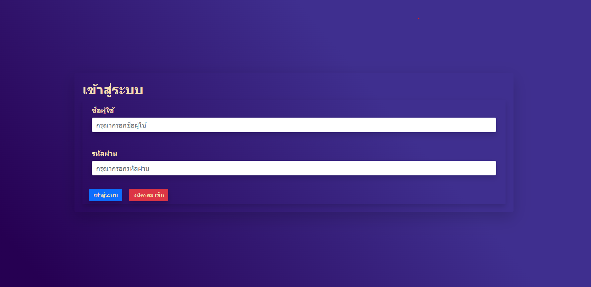
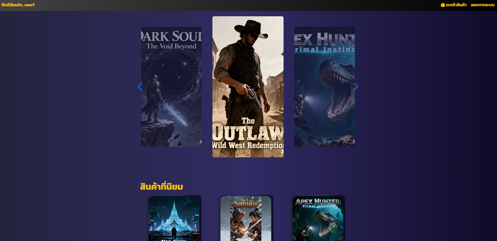
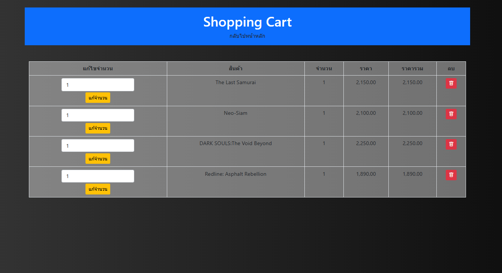
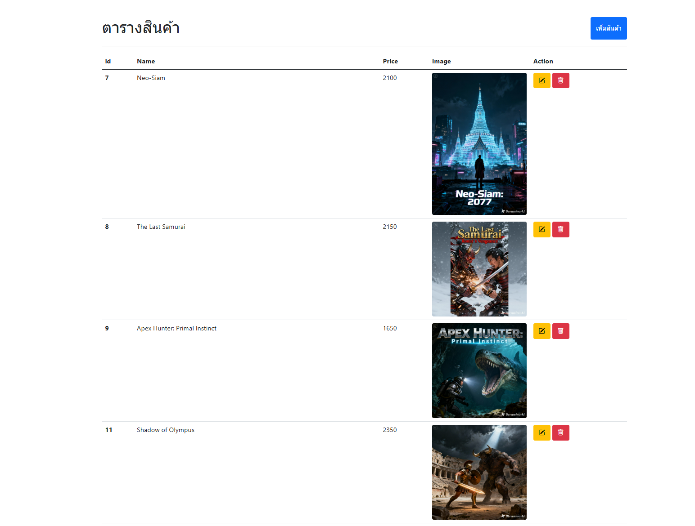

# PROJECT KEYS STORE

เว็บไซต์ขายKEYS GAMES พัฒนาโดยใช้ PHP และ MySQL  
มีระบบสมาชิก ตะกร้าสินค้า และระบบแอดมิน

## Contents
- [Screenshots](#-screenshots)
- [Features](#features)
- [Technologies](#technologies)
- [Project Structure](#project-structure)
- [Database Structure](#database-structure)
- [Security Notes](#security-notes)
- [Installation](#installation)
- [Usage](#usage)
- [Author](#author)

## 📸 Screenshots

<p align="center">
  
</p>

<p align="center">
  
</p>

<p align="center">
  
</p>

<p align="center">
  
</p>

## Features
- สมัครสมาชิก / เข้าสู่ระบบ
- ระบบตะกร้าสินค้า
- ระบบแอดมิน
- CRUD ข้อมูล
- เพิ่มKEYSเกมส์

## Technologies
- PHP
- MySQL
- HTML / CSS
- Bootstrap 5
- JavaScript

## Project Structure
```
PROJECT-PHP/
│
├── admin/                     # ส่วนผู้ดูแลระบบ
│   ├── admin_page.php          # หน้าแดชบอร์ดแอดมิน
│   ├── dashbord.php
│   ├── edit_game.php           # แก้ไขข้อมูลสินค้า/เกม
│   ├── edit_keys.php           # แก้ไขคีย์เกม
│   ├── edit_users.php
│   ├── game_delete.php
│   ├── insert_keys.php         # เพิ่มคีย์เกมใหม่
│   ├── insert_product.php      # เพิ่มสินค้าใหม่
│   ├── key_delete.php
│   ├── key_games.php           # จัดการคีย์เกม (แสดงรายการคีย์)
│   ├── order_delete.php
│   ├── orders_admin.php
│   ├── product.php
│   └── user_delete.php
│
├── auth/                      # ระบบยืนยันตัวตน
│   ├── login.php              # หน้าเข้าสู่ระบบ
│   ├── logout.php             # ออกจากระบบ
│   ├── register.php           # สมัครสมาชิก
│   ├── roe.php                # ตรวจสอบสิทธิ์ (role)
│   └── signin.php             # ประมวลผลการเข้าสู่ระบบ
│
├── cart/                      # ระบบตะกร้าสินค้า
│   ├── add_to_cart.php        # เพิ่มสินค้าเข้าตะกร้า
│   ├── backup
│   ├── cart_page.php          # แสดงรายการสินค้าในตะกร้า
│   └── orders.php
│
├── config/                    # การตั้งค่าระบบ
│   └── data.php               # การเชื่อมต่อฐานข้อมูล
│
├── includes/                  # ไฟล์ที่เรียกใช้ซ้ำ
│   ├── slide.php              # สไลด์ / ส่วนแสดงผลร่วม
│   └── userpage.php
│
├── loadpicture/
├── pages/                     # หน้าทั่วไปของเว็บไซต์
│   ├── inbox.php
│   ├── page.php
│   └── PAGEBACKUP
│
├── screenshot/
├── test/                      # ใช้สำหรับทดสอบระบบ
│   ├── header.php
│   ├── index.php
│   ├── styles.css
│   └── test.php
│
├── upload/                    # เก็บไฟล์ที่อัปโหลด (รูปสินค้า ฯลฯ)
│
├── README.md                  # เอกสารอธิบายโปรเจกต์
└── VALIDATION_REPORT.md       # รายงานการตรวจสอบ
```

## Database Structure

โปรเจกต์นี้ใช้ฐานข้อมูล MySQL โดยมีตารางหลักดังนี้

### users
- id (PRIMARY KEY)
- username
- password (hash)
- email
- creattime (วันที่สร้าง)
- role (admin / user)

ใช้สำหรับจัดการข้อมูลผู้ใช้งานและสิทธิ์การเข้าถึง

### products
- id (PRIMARY KEY)
- name
- price
- image

ใช้สำหรับจัดการข้อมูลสินค้า

### cart
- cart_id (PRIMARY KEY)
- user_id
- product_id

ใช้สำหรับจัดการตะกร้าสินค้า

### cart_items
- cart_item_id (PRIMARY KEY)
- cart_id
- product_id
- price
- quantity

แสดงสินค้าของแต่ละUSER

### key_games
- key_id (PRIMARY KEY)
- product_id (foreign key)
- order_id
- game_key (foreign key)
- status
- created_at

เก็บKEYSเกมส์

### inbox_keys
-id (PRIMARY KEY)
-order_id (foreign key)
-user_id (foreign key)
-product_id 
-key_id (foreign key)
-game_key
-created_at

เก็บกล่องจดหมายของUSER

### oeder
-order_id (PRIMARY KEY)
-user_id (foreign key)
-total_price
-order_status
-order_date

เก็บorder

### oeder_items
-order_item_id (PRIMARY KEY)
-order_id (foreign key)
-product_id (foreign key)
-quantity
-price

เก็บจำนวนสินค้าใน order


## Security Notes ⚠️
โปรเจกต์นี้มีปัญหาด้านความปลอดภัยที่สำคัญ ตามรายงาน VALIDATION_REPORT.md:

- **SQL Injection Vulnerabilities**: หลีกเลี่ยงการใช้ตัวแปรโดยตรงใน SQL queries
- **Incorrect File Paths**: ตรวจสอบเส้นทางไฟล์ให้ถูกต้อง
- **XSS Vulnerabilities**: ตรวจสอบและกรองข้อมูลที่รับมาจากผู้ใช้
- **Weak Password Hashing**: ใช้ hashing ที่ปลอดภัยเช่น bcrypt

กรุณาอ่าน VALIDATION_REPORT.md สำหรับรายละเอียดและการแก้ไข

## Installation
1. Clone หรือ Download โปรเจกต์
2. วางในโฟลเดอร์ htdocs
3. สร้างฐานข้อมูล
4. ตั้งค่าไฟล์ config/data.php

## Usage
เข้าใช้งานผ่าน  
http://localhost/project-php/auth/login.php

## Author
Jarus (Bonus)
Junior Web Developer